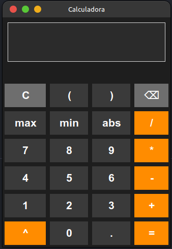
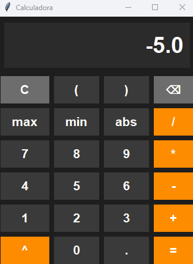
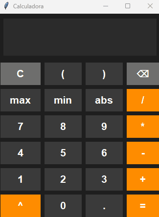

<div align="center">

# Calculadora Python — GUI + CLI

[](https://github.com/WorkTeam01/team-practice/actions/workflows/ci.yml)
[](https://www.python.org/downloads/)
[](LICENSE)

Calculadora con interfaz gráfica (tkinter) e interfaz de línea de comandos, escrita en Python. Soporta operaciones básicas, funciones científicas y expresiones con paréntesis anidados. Incluye suite de tests automatizados y pipeline de CI/CD.

</div>

---

## Capturas

<div align="center">



</div>

|                       Operaciones básicas                        |                        Funciones científicas                         |                 Manejo de errores                 |
| :--------------------------------------------------------------: | :------------------------------------------------------------------: | :-----------------------------------------------: |
|  |  |  |

---

## Instalación

**Requisitos:** Python 3.12+

```bash
git clone https://github.com/WorkTeam01/team-practice.git
cd team-practice
pip install -r requirements.txt
```

---

## Uso

**Interfaz gráfica:**

```bash
python src/gui.py
```

**Línea de comandos:**

```bash
python src/cli.py
```

---

## Operaciones disponibles

### Básicas

| Operación      | Sintaxis |
| -------------- | -------- |
| Suma           | `a + b`  |
| Resta          | `a - b`  |
| Multiplicación | `a * b`  |
| División       | `a / b`  |
| Potencia       | `a ^ b`  |

### Expresiones con paréntesis

Soporta expresiones complejas con paréntesis anidados:

```
(2+3)*4       = 20
2*(3+4)       = 14
(5-2)*(6+4)   = 30
((2+3)*4)/5   = 4
(2+3)^2       = 25
```

### Funciones científicas

| Función     | Descripción                    |
| ----------- | ------------------------------ |
| `abs(x)`    | Valor absoluto                 |
| `max(a, b)` | Valor máximo entre dos números |
| `min(a, b)` | Valor mínimo entre dos números |

---

## Atajos de teclado (GUI)

| Tecla               | Acción                 |
| ------------------- | ---------------------- |
| `0-9`               | Ingresar dígitos       |
| `.`                 | Punto decimal          |
| `+` `-` `*` `/` `^` | Operadores matemáticos |
| `(` `)`             | Paréntesis             |
| `Enter` / `=`       | Calcular resultado     |
| `Escape`            | Limpiar display        |
| `Backspace`         | Borrar último carácter |

---

## Tests

```bash
# Todos los tests
pytest -v

# Por módulo
pytest tests/test_calculator.py -v
pytest tests/test_gui.py -v

# Filtrar por nombre
pytest tests/test_gui.py -k "parenthesis" -v

# Con reporte de cobertura
pytest --cov=src --cov-report=html -v
```

El suite cubre 63+ casos de prueba. Los tests de GUI se ejecutan sin pantalla mediante mocks de tkinter definidos en `tests/conftest.py`, lo que los hace compatibles con entornos CI/CD.

---

## Estructura del proyecto

```
team-practice/
├── src/
│   ├── calculator.py      # Lógica matemática (funciones puras)
│   ├── cli.py             # Interfaz de línea de comandos
│   └── gui.py             # Interfaz gráfica con tkinter
├── tests/
│   ├── conftest.py        # Mocks de tkinter para pruebas headless
│   ├── test_calculator.py # Tests unitarios del core
│   └── test_gui.py        # Tests de la interfaz gráfica
├── .github/
│   └── workflows/ci.yml   # Pipeline de CI/CD con GitHub Actions
├── docs/
│   └── USER_GUIDE.md
├── CHANGELOG.md
├── requirements.txt
└── LICENSE
```

---

## Flujo de trabajo

El proyecto sigue **Git Flow** con **Conventional Commits**.

### Ramas

| Rama                 | Propósito                           |
| -------------------- | ----------------------------------- |
| `main`               | Producción (siempre estable)        |
| `dev`                | Integración de features             |
| `feature/nombre`     | Nuevas funcionalidades              |
| `bugfix/descripcion` | Corrección de errores               |
| `hotfix/descripcion` | Correcciones urgentes en producción |
| `release/X.Y.Z`      | Preparación de releases             |

### Formato de commits

```
<tipo>: <descripción breve>

Tipos: feat | fix | docs | test | refactor | style | chore
```

**Ejemplos:**

```
feat: agregar soporte de paréntesis en calculadora
fix: corregir validación de decimales negativos
test: agregar tests para paréntesis anidados
```

### Proceso de contribución

1. Crear o asignarse un issue
2. Crear rama desde `dev`: `git checkout -b feature/mi-funcionalidad`
3. Implementar cambios con tests incluidos
4. Abrir Pull Request hacia `dev` usando la plantilla del repositorio
5. Esperar aprobación de code review antes de mergear

---

## Releases

El proyecto sigue [versionamiento semántico](https://semver.org/). Ver [CHANGELOG.md](CHANGELOG.md) para el historial completo.

| Versión   | Fecha      | Cambios principales                          |
| --------- | ---------- | -------------------------------------------- |
| **2.1.0** | 2025-12-03 | Soporte de paréntesis, reorganización, fixes |
| **2.0.0** | 2025-11-28 | Interfaz gráfica, testing, CI/CD             |
| **1.0.0** | 2025-11-04 | Calculadora CLI básica                       |

---

## Contribuciones

Las contribuciones son bienvenidas. Consulta [CONTRIBUTING.md](CONTRIBUTING.md) para conocer el flujo de trabajo, convenciones de commits y proceso de Pull Request.

---

<div align="center">

Este proyecto está bajo la [Licencia MIT](LICENSE).

</div>
